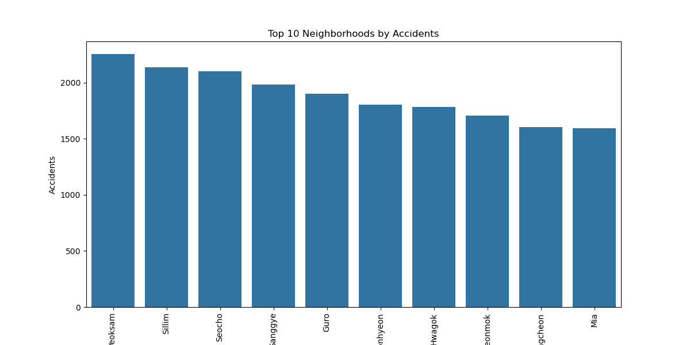

# 🚦 Seoul Daily Hourly Traffic Accident Analysis

## 📖 Project Overview
This project provides a **comprehensive analysis of traffic accidents in Seoul** using original accident data.  
The goal is to understand accident patterns, severity, and geographic distribution to support **data-driven safety decisions**.  

The project includes:  
- **Original dataset** (`data/Seoul_Accidents.csv`)  
- **SQL queries** (`sql/Seoul_Accidents_Queries.sql`) – 15 advanced queries  
- **Python scripts** (`python/Seoul_Accidents_Analysis.py`) for data cleaning, renaming columns to English, and generating visualizations  
- **Power BI Dashboard** (`dashboard/Seoul_Accidents_Dashboard.pbix`) – multi-page interactive dashboard  

---

## 🗂 Project Structure
```
Seoul_Traffic_Accidents/
│
├─ data/
│ └─ Seoul_Accidents.csv
│
├─ sql/
│ └─ Seoul_Accidents_Queries.sql
│
├─ python/
│ └─ Seoul_Accidents_Analysis.py
│
├─ plots/
│ └─ Correlation_Heatmap.png
│ └─ Casualty_Distribution.png
│ └─ Top10_Neighborhoods.png
│ └─ Severity_Ratio_Hour.png
│ └─ Fatality_Ratio_District.png
│ └─ Accidents_By_Month.png
│ └─ Accidents_By_Weekday.png
│
├─ dashboard/
│ └─ Seoul_Accidents_Dashboard.pbix
│
└─ README.md
```

---

## 🧰 Data Description
The dataset includes the following columns:  
```
| Column Name (English) | Description |
|----------------------|-------------|
| Date                 | Date of accident |
| Hour                 | Hour of accident (0-23) |
| City                 | City (Seoul) |
| District             | District in Seoul |
| Neighborhood         | Neighborhood name |
| Accidents            | Number of accidents |
| Fatalities           | Number of fatalities |
| Serious_Injuries     | Number of serious injuries |
| Minor_Injuries       | Number of minor injuries |
| Reported_Injuries    | Number of reported injuries |
```
---

## 📝 SQL Queries
- **15 advanced queries** included in `Seoul_Accidents_Queries.sql`  
- Example analytical questions:  
  1. Total number of accidents per year.  
  2. Districts with highest fatality ratio.  
  3. Accident frequency by hour.  
  4. Top 10 neighborhoods by total accidents.  
  5. Distribution of injury types across districts.  
  ...and more.  

---

## 🐍 Python Analysis
The Python script `Seoul_Accidents_Analysis.py` performs:  
1. Renaming columns to English  
2. Mapping Districts and Neighborhoods from Korean to English  
3. Saving cleaned data as `Seoul_Accidents_Cleaned.csv`  
4. Generating visualizations with **matplotlib** and **seaborn**  

---

### 1️⃣ Correlation Heatmap :
```python
sns.heatmap(df[["Accidents","Fatalities","Serious_Injuries","Minor_Injuries","Reported_Injuries"]].corr(),
            annot=True, cmap="coolwarm", fmt=".2f")
plt.title("Correlation Heatmap of Accident Variables")
plt.savefig("images/Correlation_Heatmap.png")
plt.show() 
```


#### Observations:

- Accidents vs Fatalities: 0.01
- Serious vs Minor Injuries: -0.26
- Minor vs Reported Injuries: -0.07
- Fatalities vs Serious Injuries: -0.02

### 2️⃣ Distribution of Injuries (Pie Chart) :
```python
casualty_totals = [
    df["Fatalities"].sum(),
    df["Serious_Injuries"].sum(),
    df["Minor_Injuries"].sum(),
    df["Reported_Injuries"].sum()
]
labels = ["Fatalities", "Serious Injuries", "Minor Injuries", "Reported Injuries"]

plt.pie(casualty_totals, labels=labels, autopct="%1.1f%%", startangle=90)
plt.title("Distribution of Casualties")
plt.savefig("images/Casualty_Distribution.png")
plt.show()
```


***Percentages:***

- Minor Injuries: 69.6%
- Serious Injuries: 20.9%
- Reported Injuries: 8.9%
- Fatalities: 0.6%

### 3️⃣ Top 10 Neighborhoods by Accidents :
```python
neighborhoods = df.groupby("Neighborhood").sum().reset_index().sort_values("Accidents", ascending=False).head(10)
sns.barplot(x="Neighborhood", y="Accidents", data=neighborhoods)
plt.xticks(rotation=90)
plt.title("Top 10 Neighborhoods by Accidents")
plt.savefig("images/Top10_Neighborhoods.png")
plt.show()
```



***Approximate accident counts:***

- Kotsam: 2300
- Sillim: 2100
- Seocho: 2100
- Yangyo: 1980
- Guro: 1900
- Hyeonyon: 1800
- Wagok: 1780
- Nomok: 1700
- Hachen: 1600
- Mia: 1590

#### 4️⃣ Casualty Severity Ratio by Hour :
```python
plt.plot(df.groupby("Hour")["Severity_Ratio"].mean())
plt.title("Casualty Severity Ratio by Hour")
plt.xlabel("Hour")
plt.ylabel("Severity Ratio")
plt.savefig("images/Severity_Ratio_Hour.png")
plt.show()
```


#### 5️⃣ Fatality Ratio by District :
```python
df.groupby("District")["Fatality_Ratio"].mean().plot(kind="bar")
plt.title("Fatality Ratio by District")
plt.savefig("images/Fatality_Ratio_District.png")
plt.show()
```


### Additional Visualizations :

- Accidents by Month (Bar chart)
- Accidents by Weekday (Bar chart)
- Total Casualties by Year (Bar chart)
- Serious Injuries by District (Bar chart)
- Fatalities by Hour (Line chart)
- Total Accidents by District (Bar chart)
- Total Accidents by Hour (Bar chart)
***- All visualizations use English column names and mapped District/Neighborhood names.***

### 📊 Power BI Dashboard :

**- Multi-page interactive dashboard (Seoul_Accidents_Dashboard.pbix)**
***Pages:***

- Overview (KPIs, trends, top districts)
- Accidents by Time (hourly & weekday analysis)
- Severity Analysis (casualty distribution, severity ratio)
- Geospatial Analysis (map by districts & top neighborhoods)
- Seasonal & Reporting Analysis (month-wise, reported injuries)

---

## 💡 Insights & Recommendations :

- Songpa, Gangnam, and central Seoul districts have the highest accident counts
- Peak accident hours: 16:00 – 19:00
- Minor injuries dominate (~70%), fatalities are very low (~0.6%)
- Weekend accidents higher on Fridays and Saturdays
- Safety campaigns should focus on high-accident neighborhoods during peak hours

---

### 👨‍💻 Prepared by :

***Mohamed Emad Alhadi | Data Analyst***
📩 mohamedemad24649@gmail.com
